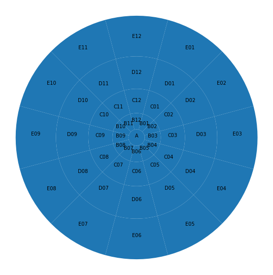

# zonebuilder
The goal of zonebuilder is to break up large geographic regions such as cities into manageable zones. Zoning systems are important in many fields, including demographics, economy, health, and transport. The zones have standard configuration, which enabled comparability across cities. See its website at [zonebuilders.github.io](https://zonebuilders.github.io/#1).
Also checkout https://zonebuilders.github.io/zonebuilder-rust/ for visualization.
This package provides the python bindings for [zonebuilder-rust](https://github.com/zonebuilders/zonebuilder-rust).

## Usage
### Installation
```python
pip install zonebuilder
```
use with `Python 3.6` and above.

### Creating zones
The core function of this library is `clockboard`. 

```python
import zonebuilder
zones = zonebuilder.clockboard(center, kwargs) #eg. zonebuilder.clockboard([0,0])

## OPTIONS:
##      center, REQUIRED: a list with an x and y coordinate specifying the center of the region of interest
##      kwargs, OPTIONAL keyword arguments
##      distances = <distances>...
##             The distances between concentric rings. `zonebuilder.triangular_sequence` is useful to 
##             generate these distances [default: 1.0,3.0,6.0,10.0,15.0] given by triangular_sequence(5)
##      num-segments = <num-segments>
##             The number of radial segments. Defaults to 12, like the hours on a clock [default: 12]
##      num-vertices-arc = <num-vertices-arc>
##             The number of vertices per arc. Higher values approximate a circle more accurately [default: 10]
##      precision = <precision>
##             The number of decimal places in the resulting output GeoJSON files. Set to 6 by default. 
##             Larger numbers mean more precision, but larger file sizes [default: 6]
##      projected = <projected>
##             Boolean, is the data projected? [default: False]
```
which will return a stringified geojson object. You can load it into other python geo libraries as follows:
```python
#geojson
import geojson
featurecollection = geojson.loads(zones)

#geopandas
import geopandas
geodataframe = geopandas.GeoDataFrame.from_features(featurecollection["features"])
```
### Example
Executing `clockboard([0,0])` will yield the 49 zones shown in the following figure centered on [0,0]:


## Dev-notes
### Installation
Steps to test the python bindings for `zonebuilder-py`
1. Create a local virtual environment for python and activate it.
```
python -m venv env
source env/bin/activate
```
2. Install necessary libraries into the environment
```
pip install -r dev-requirements.txt
```
3. Develop the rust code into a python package and install it into the local environment
```
maturin develop
```
alternately you can also
```
pip install .
```
4. Test it (somehow directly typing `pytest` throws error), use below
```
python -m pytest
```

### Current functions
1. `triangular_sequence`
2. `clockboard`